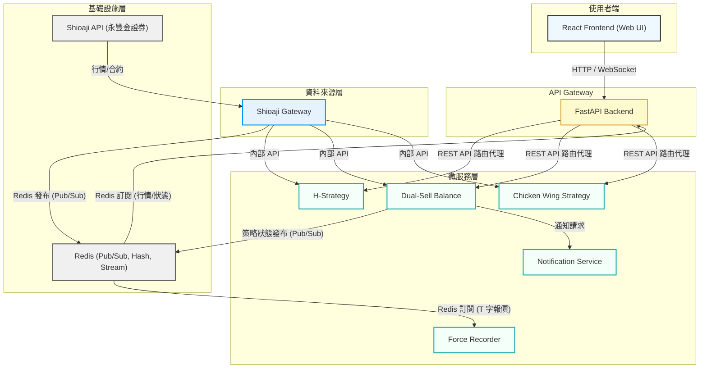

## 系統架構圖

## 架構說明

這是一個自我學習用的程式架構，因為個人對於程式交易有一些興趣，因此使用了ShioajiAPI來做為學習標的，使用上相對簡單，學習資源也多。

由於開發目標是期貨與選擇權，與股票標的相比，同時需要訂閱的商品數量較多，但由於Shioaji有單一實例最大的產品訂閱限制，因此採取訂閱一次使用多次的策略，透過實作核心API Gateway的方式，子系統透過內部發布訂閱去取得即時資訊做判斷以及觸發，保持系統的簡潔跟高效，目前仍有許多細節需要完善的，這主要是紀錄開發歷程的心得以及想法，以方便日後回顧跟討論。

