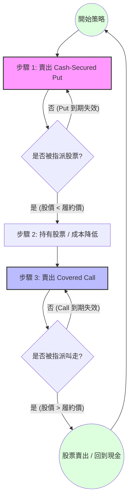
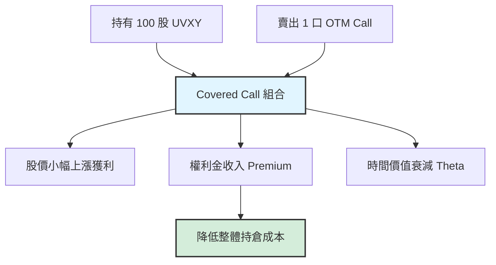

<div style="position: relative; padding-bottom: 56.25%; height: 0; overflow: hidden; max-width: 100%; margin: 20px 0;">
  <iframe
    src="https://www.youtube.com/embed/8RmLSDRNSQw"
    style="position: absolute; top: 0; left: 0; width: 100%; height: 100%;"
    frameborder="0"
    allow="accelerometer; autoplay; clipboard-write; encrypted-media; gyroscope; picture-in-picture"
    allowfullscreen>
  </iframe>
</div>

## 前言

今天來記錄一下一個美股策略 UVXY 搭配 選擇權 Wheel + CoverdCall 策略

## 美股標的與選擇權的關係

### 一、美股是「標的」

美股（例如 AAPL、MSFT、SPY）是選擇權所對應的基礎資產。

選擇權的價格、風險、獲利，都來自於美股價格的變動。

👉 **沒有股票，就不會有對應的選擇權**

### 二、美式選擇權是「工具」

美股市場使用的幾乎都是**美式選擇權**，特色是：

✔ 到期前任何一天都可以行權

分成兩種類型：

- **Call（買權）**：看漲股票
- **Put（賣權）**：看跌或保護股票

它可以用來：

- 放大報酬（槓桿）
- 降低風險（避險）
- 創造現金流（賣權收權利金）

### 三、常見的股票 × 選擇權關係（實務角度）

#### 1️⃣ 股票 + Put → 保險

- 持有股票 + 買 Put
- 類似幫股票買保險，限制最大虧損

#### 2️⃣ 沒有股票 + 賣 Put → 想低接

- 賣 Put 收權利金
- 若被指派，用「較低價格」買進股票

#### 3️⃣ 持股 + 賣 Call → 收租

- 已有股票，賣 Call
- 股票不大漲時，可穩定收權利金

👉 這也是很多人做 **Wheel 策略**的核心

### 四、為什麼美股一定要搭配選擇權看？

因為在美股市場：

- 📌 選擇權流動性極高
- 📌 機構、做市商大量使用選擇權
- 📌 股價波動、財報、事件風險，都會反映在隱含波動率（IV）

👉 **不看選擇權，等於少看一半市場資訊**

### 一句話總結

美股是舞台，美式選擇權是讓你控制風險、放大或穩定收益的工具。

## 什麼是 Wheel 策略？

### 核心概念

**Wheel 策略**（Put → 股票 → Call 的循環）

先賣 Put 想買股票 → 再賣 Call 收租 → 重複輪轉

```
Wheel = Covered Call + 前面的「賣 Put」階段
```

### Step 1️⃣：賣 Put（想低接）

賣出 Put，收權利金。

心態是：**「如果被指派，我願意用這個價格買股票」**

**可能結果：**

- ❌ 沒被指派 → 繼續賣 Put
- ✔ 被指派 → 用較低價格買進股票

### Step 2️⃣：賣 Covered Call

手上有股票後，開始賣 Call 收權利金。

**可能結果：**

- ❌ 沒被叫走 → 繼續賣 Call
- ✔ 被叫走 → 股票賣掉，回到現金

### Step 3️⃣：回到賣 Put

股票被叫走後，再回到 Step 1

👉 形成「輪子」一直轉

### Wheel 策略流程圖



## 什麼是 Covered Call 策略？

### 核心概念

**Covered Call（保護性買權賣出）**

已經有股票 → 賣 Call 收租

- 你手上持有 100 股美股（或等值部位）
- 賣出一口 Call，收權利金

### 什麼情況賺錢？

股價**橫盤或小漲**

Call 沒被行權 → 權利金就是你的

### 可能結果

#### 1️⃣ 股價 ≤ 履約價

- → Call 到期歸零
- → ✔ 保留股票 + 收到權利金

#### 2️⃣ 股價 > 履約價

- → 股票被叫走
- → ✔ 股票賣在履約價 + 權利金
- → ❌ 放棄履約價以上的漲幅

### 適合誰？

- 偏防守、想要穩定現金流
- 對「股票短期不會暴漲」有信心的人

### Covered Call 策略圖解



## 為什麼是 UVXY？

針對 **UVXY（ProShares 二倍做多 VIX 短期期貨 ETF）**執行 Wheel（輪轉策略）與 Covered Call（備兌看漲期權）策略，這是一個高風險、高報酬，且技術性要求極高的選擇。

UVXY 與一般股票（如 AAPL 或 TSLA）的特性截然不同，它追蹤的是**波動率指數（VIX）期貨**，具有長期減值（Contango 效應）與短暫噴發的特性。

### 1. 策略基礎與 UVXY 的契合點

#### 備兌看漲期權 (Covered Call)

當你持有 100 股 UVXY 時，賣出 OTM（價外）Call。

**優勢：**

- UVXY 的隱含波動率（IV）極高，這意味著你可以收取的權利金（Premium）非常豐厚。
- **對抗衰退：** 由於 UVXY 長期因轉倉成本（Contango）趨於向下掉，Covered Call 收取的權利金可以有效抵消持倉的帳面損失，降低持倉成本。

**優勢：**

- UVXY 經常在低位橫盤。
- 在 VIX 處於歷史低點時賣 Put，即使被指派持股，其成本也相對較低。

### 2. 在 UVXY 上執行這些策略的獨特優勢

#### I. 極高的權利金收益 (High IV)

- UVXY 是市場上波動率最大的標的之一。
- 高 IV 直接導致期權價格極其昂貴。
- 與標普 500 指數相比，UVXY 的期權權利金可能高出數倍。
- 這讓投資者可以在短時間內獲得顯著的現金流。

#### II. 利用「均值回歸」特性

波動率具有**均值回歸（Mean Reversion）**的特性：當 VIX 噴發後，通常會快速回落。

**賣 Call 的優勢：**

- 當市場恐慌、UVXY 暴漲時，IV 會衝到極致。
- 此時賣出深價外（Far OTM）的 Covered Call，可以捕捉權利金劇烈收縮（IV Crush）帶來的獲益，且股價隨後回落的機率很高，保護了你的持倉。

#### III. 降低持倉成本的「化骨綿掌」

- UVXY 不適合長期持有，因為它每年可能減值 80% 以上。
- 透過不斷滾動賣出 Call，你可以將原本「必賠」的長期持倉轉化為「低成本甚至零成本」的部位。
- 如果權利金收取的足夠多，你的每股成本（Cost Basis）甚至可能降到負數。

