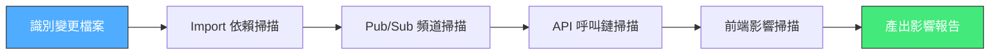
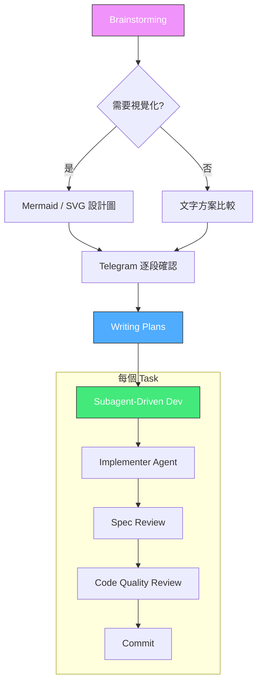
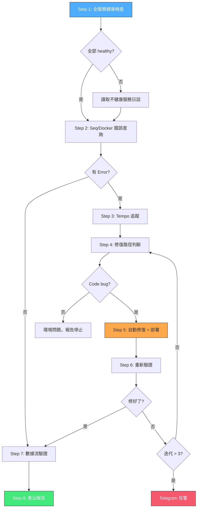
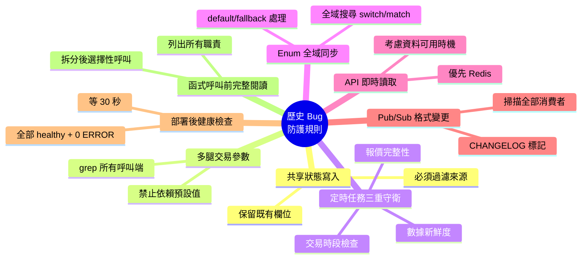
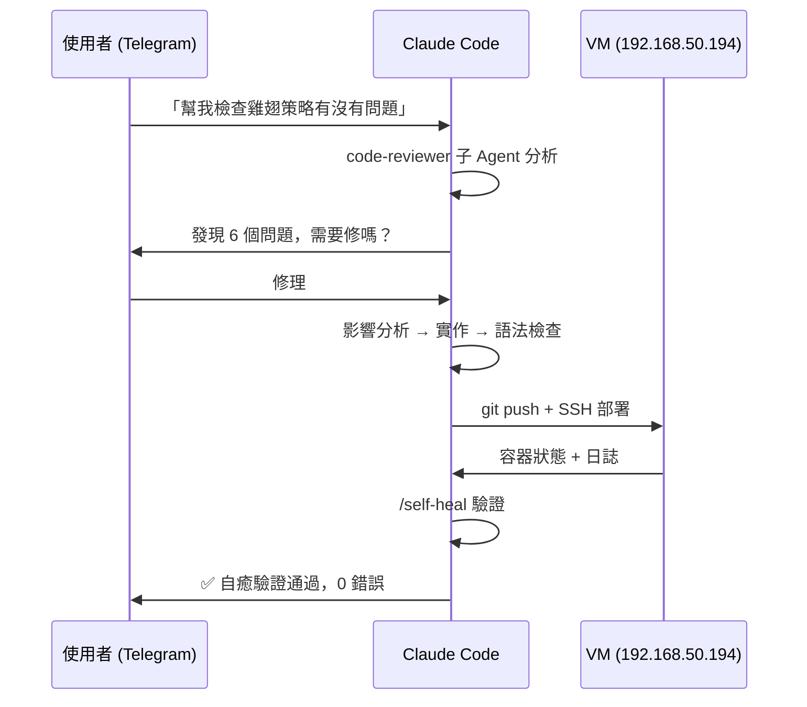

## 前言

我維護兩套衍生品交易系統 — **Shioaji**（台灣期貨選擇權，15 個微服務）和 **IBAPI**（美國期貨選擇權，FastAPI 單體）。過去半年的開發中，我逐步建立了一套**自癒式開發流程**，核心原則是：

> **需求即測試、自動診斷、自癒修復、知識沉澱。**

這套流程的「自癒」不只是指系統的自動恢復，更是指**開發流程本身會從錯誤中學習並防止重蹈覆轍**。

---

## 流程全景

<svg xmlns="http://www.w3.org/2000/svg" viewBox="0 0 800 520" style="width:100%;height:auto;max-width:100%;" font-family="'Noto Sans TC','Segoe UI',sans-serif">
  <defs>
    <filter id="s"><feDropShadow dx="1" dy="1" stdDeviation="2" flood-opacity="0.1"/></filter>
    <linearGradient id="g1" x1="0%" y1="0%" x2="100%" y2="0%"><stop offset="0%" stop-color="#667eea"/><stop offset="100%" stop-color="#764ba2"/></linearGradient>
    <linearGradient id="g2" x1="0%" y1="0%" x2="100%" y2="0%"><stop offset="0%" stop-color="#f093fb"/><stop offset="100%" stop-color="#f5576c"/></linearGradient>
    <linearGradient id="g3" x1="0%" y1="0%" x2="100%" y2="0%"><stop offset="0%" stop-color="#4facfe"/><stop offset="100%" stop-color="#00f2fe"/></linearGradient>
    <linearGradient id="g4" x1="0%" y1="0%" x2="100%" y2="0%"><stop offset="0%" stop-color="#43e97b"/><stop offset="100%" stop-color="#38f9d7"/></linearGradient>
    <linearGradient id="g5" x1="0%" y1="0%" x2="100%" y2="0%"><stop offset="0%" stop-color="#fa709a"/><stop offset="100%" stop-color="#fee140"/></linearGradient>
    <marker id="ar" markerWidth="8" markerHeight="6" refX="8" refY="3" orient="auto"><polygon points="0 0,8 3,0 6" fill="#bbb"/></marker>
  </defs>
  <rect width="800" height="520" rx="12" fill="#f8f9fc"/>
  <text x="400" y="30" text-anchor="middle" font-size="22" font-weight="bold" fill="#1a1a2e">自癒式開發流程</text>
  <text x="400" y="50" text-anchor="middle" font-size="13" fill="#888">需求即測試 · 自動診斷 · 自癒修復 · 知識沉澱</text>
  <g filter="url(#s)"><rect x="10" y="68" width="100" height="72" rx="12" fill="url(#g1)"/><text x="60" y="96" text-anchor="middle" font-size="24" fill="white">📱</text><text x="60" y="118" text-anchor="middle" font-size="13" font-weight="bold" fill="white">Telegram</text><text x="60" y="133" text-anchor="middle" font-size="10" fill="rgba(255,255,255,0.7)">下達指令</text></g>
  <line x1="110" y1="104" x2="128" y2="104" stroke="#bbb" stroke-width="2" marker-end="url(#ar)"/>
  <g filter="url(#s)"><rect x="133" y="68" width="115" height="72" rx="12" fill="url(#g2)"/><text x="190" y="92" text-anchor="middle" font-size="11" font-weight="bold" fill="white">PHASE 0</text><text x="190" y="112" text-anchor="middle" font-size="14" font-weight="bold" fill="white">影響分析</text><text x="190" y="130" text-anchor="middle" font-size="10" fill="rgba(255,255,255,0.7)">import / PubSub</text></g>
  <line x1="248" y1="104" x2="266" y2="104" stroke="#bbb" stroke-width="2" marker-end="url(#ar)"/>
  <g filter="url(#s)"><rect x="271" y="68" width="115" height="72" rx="12" fill="url(#g3)"/><text x="328" y="92" text-anchor="middle" font-size="11" font-weight="bold" fill="white">PHASE 1</text><text x="328" y="112" text-anchor="middle" font-size="14" font-weight="bold" fill="white">測試情境</text><text x="328" y="130" text-anchor="middle" font-size="10" fill="rgba(255,255,255,0.7)">BDD 生成</text></g>
  <line x1="386" y1="104" x2="404" y2="104" stroke="#bbb" stroke-width="2" marker-end="url(#ar)"/>
  <g filter="url(#s)"><rect x="409" y="68" width="115" height="72" rx="12" fill="url(#g4)"/><text x="466" y="92" text-anchor="middle" font-size="11" font-weight="bold" fill="#1a1a2e">PHASE 2</text><text x="466" y="112" text-anchor="middle" font-size="14" font-weight="bold" fill="#1a1a2e">實作驗證</text><text x="466" y="130" text-anchor="middle" font-size="10" fill="rgba(0,0,0,0.4)">Subagent</text></g>
  <line x1="524" y1="104" x2="542" y2="104" stroke="#bbb" stroke-width="2" marker-end="url(#ar)"/>
  <g filter="url(#s)"><rect x="547" y="68" width="100" height="72" rx="12" fill="url(#g5)"/><text x="597" y="92" text-anchor="middle" font-size="11" font-weight="bold" fill="white">PHASE 3</text><text x="597" y="112" text-anchor="middle" font-size="14" font-weight="bold" fill="white">E2E</text><text x="597" y="130" text-anchor="middle" font-size="10" fill="rgba(255,255,255,0.7)">Playwright</text></g>
  <line x1="647" y1="104" x2="662" y2="104" stroke="#bbb" stroke-width="2" marker-end="url(#ar)"/>
  <g filter="url(#s)"><rect x="667" y="62" width="123" height="84" rx="14" fill="#1a1a2e" stroke="#f5576c" stroke-width="2"/><text x="728" y="86" text-anchor="middle" font-size="11" font-weight="bold" fill="#f5576c">PHASE 4</text><text x="728" y="108" text-anchor="middle" font-size="16" font-weight="bold" fill="white">自癒驗證</text><text x="728" y="126" text-anchor="middle" font-size="10" fill="rgba(255,255,255,0.5)">Seq + Tempo</text><text x="728" y="140" text-anchor="middle" font-size="10" fill="#f5576c">max 3 次修復</text></g>
  <g filter="url(#s)"><rect x="10" y="168" width="780" height="80" rx="12" fill="white" stroke="#e0e6ed"/><text x="35" y="196" font-size="15" font-weight="bold" fill="#1a1a2e">任務完成閉環</text><rect x="30" y="210" width="90" height="30" rx="6" fill="#667eea" opacity="0.12"/><text x="75" y="230" text-anchor="middle" font-size="12" fill="#667eea" font-weight="bold">版號 +1</text><text x="130" y="230" font-size="14" fill="#ccc">→</text><rect x="142" y="210" width="100" height="30" rx="6" fill="#667eea" opacity="0.12"/><text x="192" y="230" text-anchor="middle" font-size="12" fill="#667eea" font-weight="bold">CHANGELOG</text><text x="252" y="230" font-size="14" fill="#ccc">→</text><rect x="264" y="210" width="80" height="30" rx="6" fill="#4facfe" opacity="0.12"/><text x="304" y="230" text-anchor="middle" font-size="12" fill="#4facfe" font-weight="bold">git push</text><text x="354" y="230" font-size="14" fill="#ccc">→</text><rect x="366" y="210" width="110" height="30" rx="6" fill="#4facfe" opacity="0.12"/><text x="421" y="230" text-anchor="middle" font-size="12" fill="#4facfe" font-weight="bold">SSH 部署 VM</text><text x="486" y="230" font-size="14" fill="#ccc">→</text><rect x="498" y="210" width="105" height="30" rx="6" fill="#43e97b" opacity="0.12"/><text x="550" y="230" text-anchor="middle" font-size="12" fill="#2d8a56" font-weight="bold">Health Check</text><text x="613" y="230" font-size="14" fill="#ccc">→</text><rect x="625" y="210" width="90" height="30" rx="6" fill="#f5576c" opacity="0.12"/><text x="670" y="230" text-anchor="middle" font-size="12" fill="#f5576c" font-weight="bold">/self-heal</text><text x="725" y="230" font-size="14" fill="#ccc">→</text><rect x="737" y="210" width="40" height="30" rx="6" fill="#43e97b"/><text x="757" y="231" text-anchor="middle" font-size="16" fill="white">✔</text></g>
  <g filter="url(#s)"><rect x="10" y="268" width="780" height="100" rx="12" fill="#1a1a2e"/><text x="35" y="294" font-size="15" font-weight="bold" fill="#f5576c">/self-heal 自癒流程</text><rect x="30" y="308" width="100" height="45" rx="8" fill="rgba(255,255,255,0.07)" stroke="rgba(255,255,255,0.12)"/><text x="80" y="326" text-anchor="middle" font-size="10" fill="#4facfe" font-weight="bold">Step 1</text><text x="80" y="343" text-anchor="middle" font-size="11" fill="white">健康檢查</text><line x1="130" y1="330" x2="148" y2="330" stroke="rgba(255,255,255,0.25)" stroke-width="1.5" marker-end="url(#ar)"/><rect x="153" y="308" width="100" height="45" rx="8" fill="rgba(255,255,255,0.07)" stroke="rgba(255,255,255,0.12)"/><text x="203" y="326" text-anchor="middle" font-size="10" fill="#4facfe" font-weight="bold">Step 2</text><text x="203" y="343" text-anchor="middle" font-size="11" fill="white">Seq 錯誤</text><line x1="253" y1="330" x2="271" y2="330" stroke="rgba(255,255,255,0.25)" stroke-width="1.5" marker-end="url(#ar)"/><rect x="276" y="308" width="100" height="45" rx="8" fill="rgba(255,255,255,0.07)" stroke="rgba(255,255,255,0.12)"/><text x="326" y="326" text-anchor="middle" font-size="10" fill="#f093fb" font-weight="bold">Step 3</text><text x="326" y="343" text-anchor="middle" font-size="11" fill="white">Tempo 追蹤</text><line x1="376" y1="330" x2="394" y2="330" stroke="rgba(255,255,255,0.25)" stroke-width="1.5" marker-end="url(#ar)"/><rect x="399" y="308" width="100" height="45" rx="8" fill="rgba(255,255,255,0.07)" stroke="rgba(255,255,255,0.12)"/><text x="449" y="326" text-anchor="middle" font-size="10" fill="#ffa94d" font-weight="bold">Step 4</text><text x="449" y="343" text-anchor="middle" font-size="11" fill="white">判斷根因</text><line x1="499" y1="330" x2="517" y2="330" stroke="rgba(255,255,255,0.25)" stroke-width="1.5" marker-end="url(#ar)"/><rect x="522" y="308" width="100" height="45" rx="8" fill="rgba(255,255,255,0.07)" stroke="rgba(255,255,255,0.12)"/><text x="572" y="326" text-anchor="middle" font-size="10" fill="#ffa94d" font-weight="bold">Step 5</text><text x="572" y="343" text-anchor="middle" font-size="11" fill="white">自動修復</text><line x1="622" y1="330" x2="640" y2="330" stroke="rgba(255,255,255,0.25)" stroke-width="1.5" marker-end="url(#ar)"/><rect x="645" y="308" width="60" height="45" rx="8" fill="rgba(255,255,255,0.07)" stroke="rgba(255,255,255,0.12)"/><text x="675" y="326" text-anchor="middle" font-size="10" fill="#43e97b" font-weight="bold">Step 6</text><text x="675" y="343" text-anchor="middle" font-size="11" fill="#43e97b">驗證</text><line x1="705" y1="330" x2="723" y2="330" stroke="rgba(255,255,255,0.25)" stroke-width="1.5" marker-end="url(#ar)"/><rect x="728" y="308" width="50" height="45" rx="8" fill="rgba(67,233,123,0.15)" stroke="#43e97b"/><text x="753" y="335" text-anchor="middle" font-size="14" fill="#43e97b">📋</text><text x="753" y="349" text-anchor="middle" font-size="9" fill="#43e97b">報告</text><path d="M675,353 C675,370 449,370 449,353" stroke="#f5576c" stroke-width="1.5" fill="none" stroke-dasharray="4,3"/><text x="562" y="367" text-anchor="middle" font-size="9" fill="#f5576c">失敗 → 重試 (max 3)</text></g>
  <g filter="url(#s)"><rect x="10" y="388" width="780" height="50" rx="12" fill="#fefcf3" stroke="#e8dbb5"/><text x="35" y="412" font-size="14" font-weight="bold" fill="#8a7540">PHASE 5: 知識沉澱</text><text x="245" y="412" font-size="12" fill="#a08c50">每個 bug → 防護規則 → CLAUDE.md → AI 自動遵守</text><rect x="520" y="398" width="75" height="24" rx="5" fill="#e8dbb5"/><text x="557" y="415" text-anchor="middle" font-size="9" fill="#6b5b2e">狀態過濾</text><rect x="600" y="398" width="75" height="24" rx="5" fill="#e8dbb5"/><text x="637" y="415" text-anchor="middle" font-size="9" fill="#6b5b2e">三重守衛</text><rect x="680" y="398" width="95" height="24" rx="5" fill="#e8dbb5"/><text x="727" y="415" text-anchor="middle" font-size="9" fill="#6b5b2e">PubSub 掃描</text></g>
  <g filter="url(#s)"><rect x="10" y="455" width="780" height="55" rx="12" fill="url(#g1)" opacity="0.9"/><text x="400" y="480" text-anchor="middle" font-size="15" font-weight="bold" fill="white">📱 Telegram ↔ Claude Code ↔ VM (192.168.50.194)</text><text x="400" y="500" text-anchor="middle" font-size="12" fill="rgba(255,255,255,0.7)">任何裝置下達指令 · 不需開 IDE · 設計決策在 Telegram 確認 · 程式碼撰寫/部署/驗證全自動</text></g>
</svg>

**最低要求**：Phase 0 + 實作 + Phase 4（影響分析 + 實作 + 自癒驗證）

**完整要求**：全部 Phase（跨服務或前端變更時）

---

## Phase 0：影響分析（修改前必做）

每次接到需求後，**寫程式碼之前**先掃描影響範圍。



實際執行的掃描命令：

```bash
# 對每個被修改的模組，掃描誰依賴它
grep -rn "from X import\|import X" --include="*.py"

# 掃描 Pub/Sub 頻道的所有 publisher 和 consumer
grep -rn "publish\|subscribe\|CHANNEL" --include="*.py"

# 找出 API route 定義和內部 HTTP 呼叫
grep -rn "@router\." --include="*.py"
```

### 為什麼需要影響分析？

**慘痛案例**：v1.58.2 將 Redis Stream 遷移到 Pub/Sub 時，改了 `data` 格式但**漏改 MUD 和 KBar 的消費者**，導致全部 tick 被丟棄。如果當時做了影響分析，就會發現 `quote:tick` 頻道有 5 個消費者需要同步更新。

---

## Phase 2：實作 + Brainstorming 設計

### 小型修復：直接修

對於 bug 修復或小幅調整，跳過設計直接實作。但遵守一個原則：**發現問題直接修，不只是回報問題。**

### 大型功能：Brainstorming → Plan → Subagent

對於架構級變更，走完整設計流程：



**Brainstorming** 的核心是提出 2-3 個方案比較，在 Telegram 上逐一確認。重要的是讓使用者做**設計決策**，而不是全部交給 AI。

**Subagent-Driven Development** 的每個 Task 由獨立 Agent 實作，彼此的 context 互不干擾。完成後經過兩階段 review：先確認是否符合 spec，再檢查程式碼品質。

---

## 任務完成流程（每次修改必走）

不管改動大小，完成後都要走完這個閉環：

```mermaid
flowchart LR
    A[版號 +1] --> B[CHANGELOG]
    B --> C[git commit]
    C --> D[git push]
    D --> E[SSH 部署 VM]
    E --> F[等 30 秒]
    F --> G[/health-check]
    G --> H{healthy?}
    H -->|是| I[/self-heal]
    H -->|否| J[讀日誌修復]
    J --> A

    style A fill:#ffa94d,stroke:#333
    style E fill:#4facfe,stroke:#333,color:#fff
    style I fill:#f5576c,stroke:#333,color:#fff
```

```bash
# 1. 版號 + CHANGELOG
# VERSION, frontend/package.json, CHANGELOG.md 同步更新

# 2. Commit + Push
git add <files> && git commit -m "fix/feat: 描述"
git push origin main

# 3. 部署到 VM
ssh user@192.168.50.194 "cd /home/user/ShioajiPy && git pull && \
  docker compose build <service> && docker compose up -d <service>"

# 4. 等待 + 健康檢查
sleep 30
ssh user@192.168.50.194 "docker ps --format '{{.Names}} {{.Status}}' | grep shioaji"
```

---

## Phase 4：/self-heal 自癒驗證

這是整個流程最核心的部分。每次部署後自動執行：



### 自癒的三個層次

1. **容器層**：檢查 Docker 容器狀態（Running / Healthy / Restarting）
2. **日誌層**：從 Seq 結構化日誌和 Docker logs 中抓取 Error + TraceId
3. **修復層**：根據錯誤類型分類（Code bug / Format mismatch / Connection issue），自動定位檔案並修復

### 修復分類規則

| 錯誤模式 | 分類 | 修復方式 |
|---------|------|---------|
| `TypeError`, `AttributeError` | Code bug | 修正 Python 邏輯 |
| `JSONDecodeError`, `unexpected type` | Format mismatch | 修正 serializer + 加 isinstance 兼容 |
| `ConnectionRefusedError` | Connection issue | 檢查服務依賴 |
| External API 4xx/5xx | Environment | 報告並停止（非我方問題） |

### 最大重試 3 次

自癒循環最多執行 3 次。超過時發送 Telegram 告警：

```
自癒失敗告警
已嘗試 3 次修復但仍有錯誤

錯誤摘要：{error_summary}
最後嘗試的修復：{last_fix_description}

請人工介入處理
```

---

## Phase 5：知識沉澱

每個 bug 修復後，提煉成 **防護規則**寫入 CLAUDE.md。目前已累積 8 條規則：



這些規則不是文件上的擺設 — 它們寫在 CLAUDE.md 中，AI 每次開發時都會讀取並遵守。**系統從過去的錯誤中學習，防止未來重蹈覆轍。**

---

## 跨系統的統一標準

兩套交易系統雖然技術棧不同（Shioaji: 微服務 + Redis / IBAPI: 單體 + PostgreSQL），但共享相同的開發流程：

| 項目 | Shioaji | IBAPI |
|------|---------|-------|
| 部署 | `docker compose build + up` | `docker compose up -d --build` |
| 健康檢查 | `/health-check` Skill | `/api/diagnostics` API |
| 自癒驗證 | `/self-heal`（Seq + Docker logs） | Seq + Diagnostics API |
| 版號管理 | `VERSION` + `frontend/package.json` | `config.py` + `frontend/package.json` |
| 通知 | Telegram MCP | Telegram EventBus |

統一的流程意味著不管在哪個專案工作，行為模式和品質標準都一致。

---

## Telegram 作為開發介面

整個流程的觸發和回饋都透過 Telegram：



這種模式的好處是：**我可以在任何地方、任何裝置上下達開發指令**，不需要打開 IDE。設計決策在 Telegram 上討論確認，程式碼的撰寫、測試、部署全由 Claude Code 處理。

---

## 實際成效

以 2026-03-28 這一天為例：

| 指標 | 數值 |
|------|------|
| 跨越的專案 | 2（Shioaji + IBAPI） |
| Commits | 30+ |
| 發現的 bug | 15 |
| 修復的 bug | 15 |
| 部署次數 | 8 |
| 自癒迭代 | 2 次（啟動順序 bug 需要第二次修復） |
| 新增防護規則 | 3 條 |

---

## 經驗總結

### 1. 自癒的本質是閉環

「寫完部署就結束」是最常見的開發反模式。自癒流程強制要求每次部署後都驗證，驗證失敗就自動修復，修復後再驗證。**沒有通過驗證就不結束任務。**

### 2. 知識沉澱比修 bug 更重要

修一個 bug 是一次性的，但把它提煉成防護規則是永久的。CLAUDE.md 中的 8 條規則，每一條都源自真實的線上事故。

### 3. 影響分析是最被低估的步驟

「我只改了一行」是事故的起點。Pub/Sub 格式變更、Enum 新增值、Redis key 重命名 — 這些「小改動」如果沒有掃描所有消費者，就會在你意想不到的地方引爆。

### 4. AI 的價值在於看見盲點

code-reviewer 發現的 race condition 和封裝洩漏，是人眼 code review 容易遺漏的。讓 AI 做系統性掃描，人做設計決策 — 這是目前最有效的分工模式。

---

## 下一篇預告

下一篇文章會介紹**芒格 Agent 動態分析架構** — 如何讓交易分析系統像查理芒格那樣，根據事件性質自主選擇分析工具和推理路徑，並透過持久化的學習機制不斷改進。
